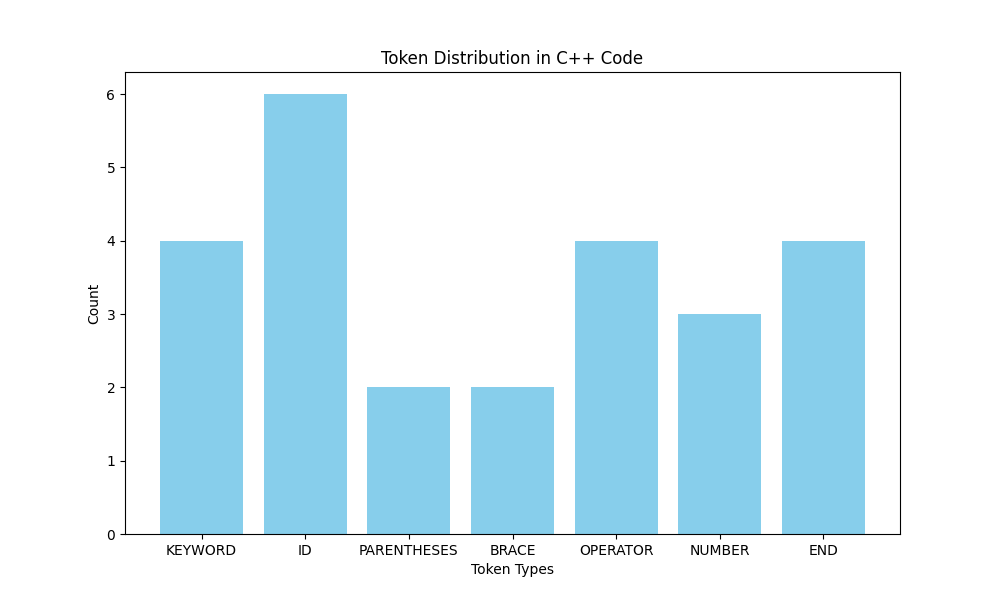

# C++ Tokenizer

## Overview
The **C++ Tokenizer** is a Python-based tool designed to parse and tokenize C++ code, identifying various elements such as keywords, identifiers, operators, and more. This tool also provides a graphical representation of the token distribution using `matplotlib`.

## Features
- **Tokenization:** Breaks down C++ code into meaningful tokens.
- **Token Types:** Recognizes keywords, identifiers, numbers, operators, and other tokens.
- **Comments Handling:** Ignores single-line and multi-line comments.
- **Graphical Representation:** Visualizes token distribution using a bar chart.
- **Tabular Display:** Displays tokens in a neatly formatted table.

## Installation
To use this project, you need to have Python 3.12 installed along with the required libraries. You can install the dependencies using `pip`.

```sh
pip install matplotlib tabulate

```

## Usage
Here's a step-by-step guide on how to use the C++ Tokenizer:
### 1) Clone the Repository:
```sh
git clone https://github.com/omaromran1/Sysytem-Programming.git
```

### 2) Run the Tokenizer:
Save your C++ code in a variable or read it from a file and then run the tokenizer script.

### 3)  View Output:
The script will print a table of tokens and display a bar chart showing the distribution of token types.



## Contributing
Feel free to modify this template to better suit your project and include any additional information that might be useful. Happy documenting! 📄😊

## License
This project is licensed under the MIT License.

## Contact
For any inquiries, please contact:

- **Name:** OMAR OMRAN

- **Email:** omaromran5678@gmail.com


## Made by OMAR OMRAN
